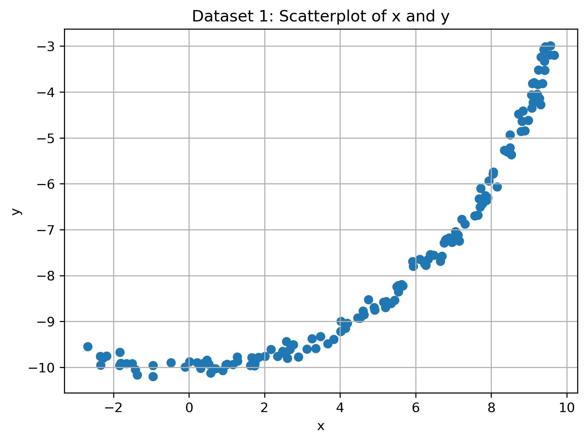
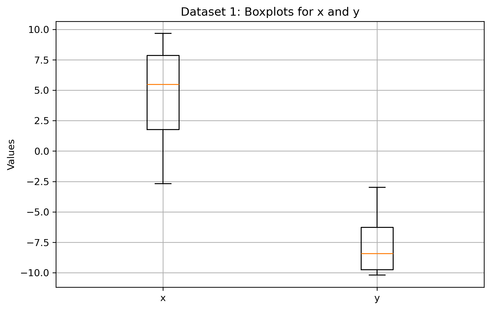
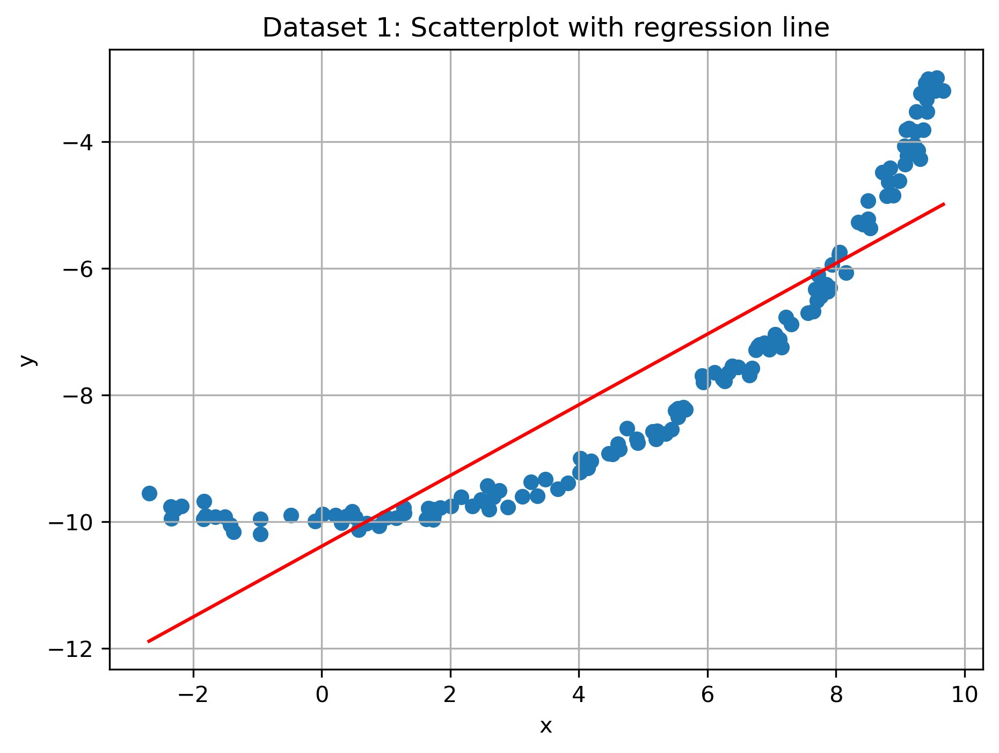
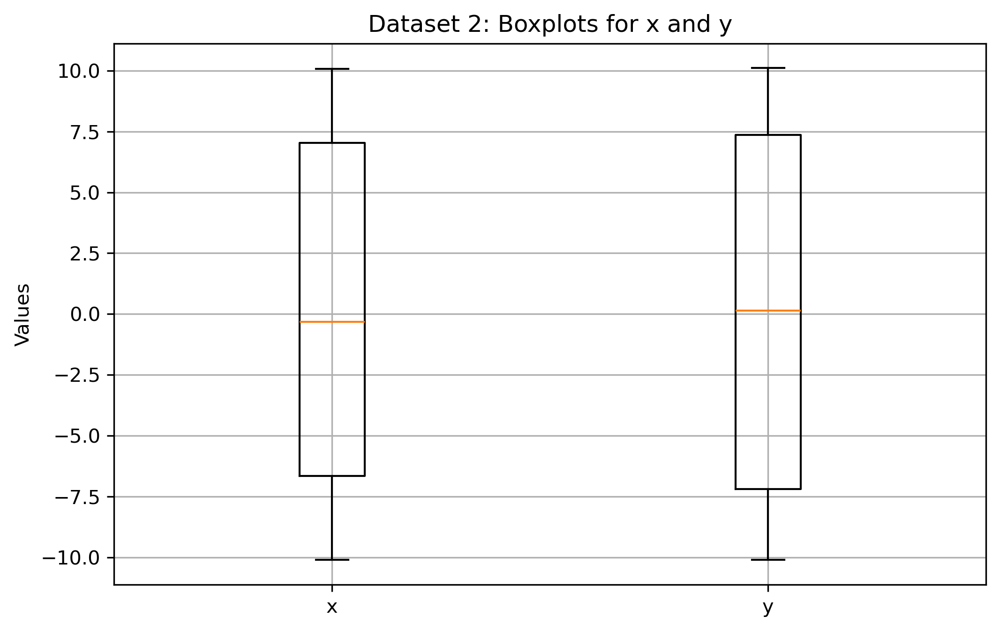
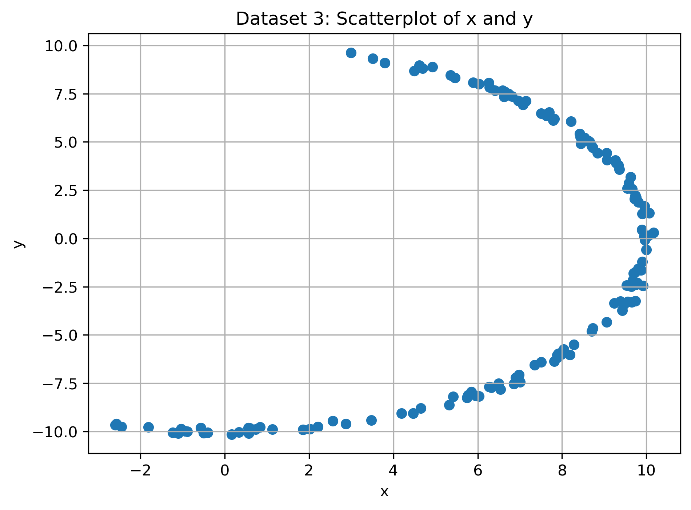
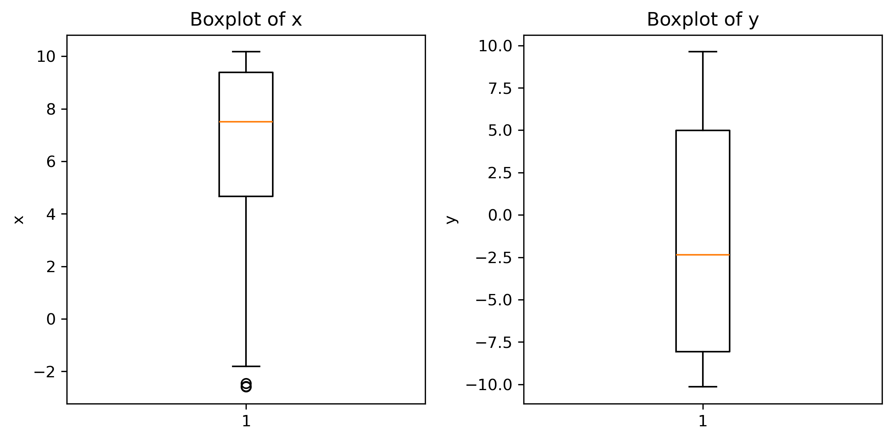

# Python Statistical Analysis

## Overview

This project compares three numerical datasets using Python-based exploratory data analysis and simple statistical modelling.

The aim is to show how scatterplots, descriptive statistics, Pearson correlation, simple linear regression, and R-squared can be used together to understand relationships between variables. The project also highlights why visual inspection is important, because some datasets may show clear non-linear patterns that are not fully captured by correlation or a straight-line regression model.

## Tools Used

- Python
- pandas
- NumPy
- Matplotlib
- Jupyter Notebook

## Repository Structure

```text
python-statistical-analysis/
│
├── README.md
├── requirements.txt
├── .gitignore
│
├── data/
│   ├── dataset1.csv
│   ├── dataset2.csv
│   └── dataset3.csv
│
├── notebooks/
│   └── statistical_analysis.ipynb
│
└── outputs/
    └── .gitkeep
```

## Dataset

This project uses three small numerical datasets. Each dataset contains two main variables: `x` and `y`.

The analysis focuses on:

- inspecting each dataset
- handling missing values
- calculating descriptive statistics
- calculating quartiles and interquartile range
- analysing Pearson correlation
- fitting simple linear regression models
- calculating R-squared values
- comparing visual patterns across datasets

## What I Did

- Loaded three datasets into pandas DataFrames
- Checked the structure and quality of each dataset
- Identified and handled missing values
- Calculated mean, median, range, sample variance, and sample standard deviation manually
- Calculated quartiles, IQR, and possible outlier bounds
- Created scatterplots to inspect the relationship between `x` and `y`
- Created boxplots to compare spread and distribution
- Calculated Pearson correlation manually
- Fitted simple linear regression lines manually
- Calculated R-squared values to assess model fit
- Compared the three datasets to show why visualisation matters in statistical analysis

## Project Outputs

### Dataset 1: Scatterplot

Dataset 1 shows a strong positive pattern. The relationship is clear, although it is not perfectly linear.



### Dataset 1: Boxplot

The boxplot helps show the spread of values and possible outliers in Dataset 1.



### Dataset 2: Scatterplot

Dataset 2 shows a circular or elliptical pattern. This is important because the Pearson correlation is very low even though the scatterplot shows a clear visual pattern.



### Dataset 2: Boxplot

The boxplot helps summarise the spread of values in Dataset 2.



### Dataset 3: Scatterplot

Dataset 3 shows a curved pattern. A straight-line regression model only captures part of the relationship.



### Dataset 3: Boxplot

The boxplot helps show the spread and distribution of values in Dataset 3.



## Key Findings

- Dataset 1 shows a strong positive relationship, with a high correlation and a relatively strong R-squared value.
- Dataset 2 shows why visualisation matters: the scatterplot reveals a clear circular or elliptical pattern, but Pearson correlation is close to zero because the relationship is not linear.
- Dataset 3 shows a curved relationship, meaning a straight-line regression model only explains part of the pattern.
- Scatterplots are essential because summary statistics alone can hide important visual patterns.
- Boxplots help compare spread, distribution, and possible outliers across datasets.

Overall, this project shows that statistical measures such as correlation and R-squared should be interpreted alongside visualisations.

## Key Skills Demonstrated

- Python programming fundamentals
- Data cleaning
- Exploratory data analysis
- Descriptive statistics
- Manual statistical calculations
- Pearson correlation
- Simple linear regression
- R-squared interpretation
- Data visualisation
- Cross-dataset comparison

## Current Status

This repository currently includes the main portfolio notebook for a comparative statistical analysis project. The notebook compares three datasets using data cleaning, descriptive statistics, correlation analysis, simple linear regression, R-squared, scatterplots, and boxplots.

Output images and README previews will be added next to make the project easier to review without opening the notebook.

## Future Improvements

- Add output images for scatterplots and boxplots
- Add a clearer visual comparison of all three datasets
- Add a summary table of correlation and R-squared values
- Add more explanation of non-linear relationships
- Improve reproducibility with package version details
